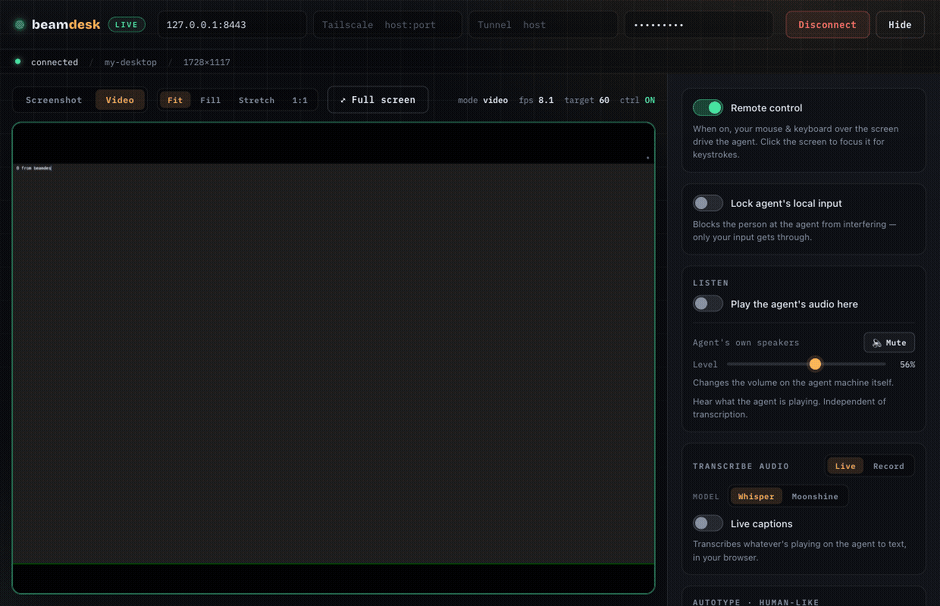

# beamdesk

**Control your own machine from any browser — its screen at 60fps, its keyboard,
its mouse, and its speakers. No relay server, no VPS, no account.**




Run the **agent** on the machine you want to control. Open the **client** — a web
app the agent serves itself — on any other device, including a phone. Above: the
browser client streaming a Mac over QUIC and typing into it with the human-like
autotyper — no software installed on the controlling device.

| | |
|---|---|
| **Video** | H.264, hardware-encoded, decoded in-browser with WebCodecs |
| **Bandwidth** | ~7.4 KB/frame, down from ~267 KB on MJPEG — **35× less** |
| **Transport** | QUIC/WebTransport where available, WebSocket everywhere else |
| **Adapts** | bitrate, resolution and fps step down on a struggling link |
| **Mobile** | touch gestures map to a trackpad; on-screen keyboard types to the remote |
| **Audio** | hear the remote machine, and control its volume and mute |
| **Extras** | human-like autotyper, local input lock, in-browser transcription |

Everything runs directly between your two machines. Nothing is uploaded, and
there is no service to sign up for.

> ## ⚠️ Authorized use only
> This tool streams a machine's screen and remotely controls its keyboard and
> mouse. **Run it only on machines you personally own, or ones you have explicit
> permission to control.** Using it to access someone else's device without their
> consent is illegal in most places. It is built for legitimate personal remote
> access — it has **no stealth, hiding, or evasion features** by design, and it
> always shows a visible cert prompt and requires a shared secret. You are
> responsible for how you use it.

A personal remote-control tool for machines you own. Run the **agent** on the
machine you want to control; open the **client** (a web app) on another device to
view its screen, control its mouse/keyboard, and run a human-like autotyper.

- **No relay server, no VPS.** The client connects directly to the agent.
- **LAN:** works with zero extra software — connect to the agent's `192.168.x.x`.
- **Remote (your own devices):** install [Tailscale](https://tailscale.com) on
  both machines and connect to the agent's `100.x.y.z` address.
- **Remote (no VPN, behind double NAT):** run a
  [Cloudflare Tunnel](#remote-access-via-cloudflare-tunnel) with `npm run tunnel`
  and connect to the `*.trycloudflare.com` URL it prints.

## Features

- **Screen streaming** — two modes:
  - **Video** (default) — **H.264**, hardware-encoded on the agent when a GPU
    encoder is available (VideoToolbox / NVENC / QSV / ddagrab), decoded in the
    browser with **WebCodecs** (`VideoDecoder`). It **auto-targets the agent's
    display refresh rate** (30 / 60 / up to 120 fps), and the **bitrate adapts to
    the link** — degrading quality (and stepping down) when the connection can't
    keep up. Falls back to JPEG automatically if H.264 encode or WebCodecs decode
    isn't available.
  - **Screenshot** — periodic **JPEG** frames. Low-frequency, low-bandwidth, and
    works in any browser (no WebCodecs needed) — the simple, universal fallback.
  - **Fit modes + fullscreen** — fit/fill/native display modes, and a fullscreen
    view with the controls as a fading overlay.
- **Two transports, auto-selected** — video rides **QUIC (WebTransport)** when the
  browser and network allow it (lower latency, no TCP head-of-line blocking),
  and transparently falls back to the **WebSocket (TCP)** otherwise. Control,
  audio, and the JPEG path always use the WebSocket. The diagnostics panel shows
  which transport won.
- **Remote control** — mouse and keyboard forwarded to the agent, mapped 1:1
  (click, double-click, right-click, drag) with resolution-independent
  coordinates. **Works from a phone** too — touch control and an on-screen
  keyboard.
- **Human-like autotyper** — types a block of text with adjustable cadence
  (base delay, jitter, occasional typo+correction), and can be **cancelled
  mid-run**.
- **Lock agent's local input** — block the physical keyboard **and mouse** at the
  agent so only the client drives it (with auto-release failsafes). Works on
  **Windows and macOS**; Linux is not yet supported.
- **Agent audio** — **hear** the agent's system audio in the browser (off by
  default), and **control the agent's volume / mute** from the client.
- **Audio transcription** — a live text transcript of whatever is playing on the
  agent, produced by **Whisper running in your browser** (audio never leaves the
  client).
- **Diagnostics panel** — one click self-checks both the browser and the agent
  (connection, transport, ffmpeg, capture engine, permissions, input-lock, audio)
  and tells you exactly how to fix anything that's wrong.
- **Direct & encrypted** — TLS everywhere, a shared secret, and no relay/VPS.
  Works over LAN, Tailscale, or a Cloudflare Tunnel.

> **How video travels:** control/audio/JPEG use one **TLS WebSocket**; H.264
> video prefers a separate **QUIC/WebTransport** connection (on the control port
> **+ 1**) and falls back to the WebSocket when QUIC isn't available (older
> browser, or a Cloudflare Tunnel). There is no WebRTC/peer-connection — the agent
> is already a reachable server, so it just sends an H.264 stream (keyframe +
> deltas) and the browser decodes it with WebCodecs; no SDP/ICE negotiation.

## Layout

```
shared/   TypeScript wire protocol (zod schemas) + binary frame codec
agent/    runs on the controlled machine (screen capture, input injection, autotyper)
client/   web app (React + Vite): view screen, control, autotype panel
```

## Prerequisites

- Node.js 20+ (built with 24).
- **macOS:** the first time the agent injects input / captures the screen, grant
  the terminal (or the app running node) permission under
  *System Settings → Privacy & Security → Screen Recording* and *Accessibility*.
- **Linux:** X11 session recommended (Wayland input injection is limited).
  `screenshot-desktop` may require ImageMagick installed.
- **Windows:** works out of the box.

## Quick start (recommended) — the launcher

The easiest way on any machine is the interactive launcher. It **auto-detects
what's missing and sets it up** (installs dependencies, prerequisites, and
builds), then shows a menu to run what you want:

```bash
npm install    # once, to get the launcher's own deps
npm start      # or: node launch.mjs
```

On first run it installs/builds automatically if needed, then presents:

```
  1  Full setup            install deps + prerequisites + build
  2  Run agent             this machine gets controlled + streamed
  3  Run agent (background) keeps running after this terminal closes
  4  Agent status          is the background agent running?
  5  Stop background agent
  6  007 James Bond        auto-start on login, survives reboot + crashes
  7  M (retire 007)        stop + remove the login-autostart service
  8  Run client            control another machine from your browser
  9  Run tunnel            expose the agent over Cloudflare (remote)
  10 Rebuild               recompile all packages
  11 Local test            agent + client on this machine
  q  Quit
```

Pick **2** (or **3**/**6** for unattended use — see below) on the machine you
want to control, and **8** on the machine you're controlling from. Ctrl-C stops
the running task and returns you to the menu.

> The launcher just orchestrates the individual `npm run …` scripts below — use
> those directly if you prefer.

## Setup (manual)

If you'd rather run the steps yourself instead of the launcher:

```bash
npm install          # installs all workspaces
npm run setup        # auto-installs prerequisites (ffmpeg, cloudflared) per-OS
npm run build        # builds shared, agent, client
```

`npm run setup` installs the agent's optional prerequisites using whatever
package manager the OS has (Homebrew on macOS; winget/choco/scoop on Windows;
apt/dnf/pacman on Linux):

- **ffmpeg** — powers screen capture and the **H.264 video encode** (using a
  hardware encoder when available). Without it, Video mode falls back to slow
  per-frame JPEG capture (a few fps). **On Windows this is the fix for low video
  fps.** After it installs on Windows, open a NEW terminal so PATH updates, then
  `npm run agent`.
- **cloudflared** — optional, only needed for `npm run tunnel` (remote access
  without a VPN).

## Run the agent (on the machine to control)

```bash
npm run agent
```

On first run it generates a config (`agent/.data/config.json`) with a random
shared secret and a self-signed TLS certificate, then prints a banner:

```
  Port:        8443
  Secret:      <your-secret>
  Cert SHA-256:AB:CD:...
  Connect from the client using one of:
    LAN:       192.168.1.20:8443
    Tailscale: 100.101.102.103:8443
```

Override via env vars: `BCSA_PORT`, `BCSA_SECRET`, `BCSA_NICKNAME`.

> The agent also opens **`BCSA_PORT` + 1** (UDP) for the **QUIC/WebTransport**
> video path. It's optional — if that port is blocked or the browser lacks
> WebTransport, video falls back to the TCP WebSocket on the main port. Over
> Tailscale both work; over a Cloudflare Tunnel only the WebSocket path is used.

## Running the agent unattended

`npm run agent` runs in the foreground and dies with the terminal. The
launcher (`npm start`) has two ways to keep it running without a terminal open:

**Option 3 — plain background.** Starts the agent detached, right now, until
you stop it or reboot. Output goes to `agent/.data/agent.log`; the PID is
tracked in `agent/.data/agent.pid`.
- **4** checks whether it's running, **5** stops it.
- Starting it again while it's already running is a no-op, not a duplicate
  process.

**Option 6 — 007 James Bond.** Installs the agent as a real, per-user
**login-autostart service** — it comes back on its own after a reboot, and
restarts itself if it crashes. No admin/sudo needed. Under the hood:
- **macOS** — a `launchd` LaunchAgent (`~/Library/LaunchAgents/dev.beamdesk.agent.plist`).
- **Linux** — a `systemd --user` unit (`~/.config/systemd/user/beamdesk-agent.service`).
- **Windows** — a Task Scheduler task (`BeamdeskAgent`), triggered at logon.

It's **login-triggered, not boot-triggered on purpose**: screen capture only
works inside a real logged-in graphical session, so a true boot-time service
(running as root/SYSTEM, before anyone logs in) would need elevated privileges
to install and still capture nothing until someone actually logs in.

- **7 (M — retire 007)** stops it and removes the login-autostart registration.
- Plain background and 007 both bind the same port, so only one may run the
  agent at a time — starting one while the other is active is refused with a
  message instead of crashing.
- **Agent status (4)** reports both mechanisms together.

> ⚠️ **macOS note:** a permission you granted to Terminal (Accessibility,
> Screen Recording) does **not** carry over to a process `launchd` runs
> directly. If the agent keeps restarting after installing 007, check
> `agent/.data/agent.log` — you likely need to grant that permission again to
> whatever binary shows up there, in System Settings → Privacy & Security.

## Open the client (on your controlling device)

**Easiest — the agent serves the client.** Once the agent is running (and the
client has been built via `npm run build`), just open the agent in a browser:

```
https://<agent-ip>:8443      e.g. https://192.168.0.119:8443
```

Accept the self-signed cert once (see step 3 below), and the client app loads
right there — no separate server needed. This is the recommended way.

**For development** you can still run the Vite dev server instead:

```bash
npm run client       # http://localhost:5173, hot-reload
```

Either way, in the client:

1. Enter the agent's **LAN address** (e.g. `192.168.0.119:8443`) and, if you'll
   connect remotely, its **Tailscale address** and/or **Tunnel host** too. (If you
   opened the agent-served client, the address is already filled in.)
2. Enter the **secret** from the agent banner.
3. **Accept the agent's certificate first (LAN/Tailscale only).** Because the
   agent uses a self-signed cert, a browser will *silently refuse* the `wss://`
   connection until you've trusted it — and the WebSocket never shows a prompt.
   So before connecting, open the agent directly in a new browser tab:

   ```
   https://192.168.0.119:8443       ← the agent's IP + port, single https://
   ```

   You'll get a "Your connection is not private" warning — click **Advanced →
   Proceed / Continue** (in Chrome you can also just type `thisisunsafe`).
   Optionally verify the cert's SHA-256 matches the agent banner. When it works
   you'll see a **"✅ Agent reachable"** page — that confirms the cert is trusted
   *and* that the address is reachable.
4. Go back to the client and press **Connect**. It tries LAN first, then
   Tailscale, then the tunnel. (A Cloudflare **Tunnel** URL uses Cloudflare's own
   trusted cert, so it needs no cert-acceptance step — skip #3 for the tunnel.)

> **If Connect just spins:** it's almost always the cert (step 3 not done for
> that address) or the agent isn't reachable at that IP. Opening
> `https://<agent-ip>:8443` in a tab tells you which: a cert warning → do step 3;
> "can't reach this site" → wrong IP / network isolation (use the Ethernet or
> Tailscale address instead).

### Getting rid of the certificate warning for good

The warning is not about your network — it appears on LAN too. The agent signs
its own certificate, and browsers only trust certificates issued by a known
authority. Accepting the warning stores an exception for **that one origin**,
which is why `127.0.0.1`, your LAN IP and your Tailscale IP each ask separately.

Three ways out, in order of how little work they are:

1. **Tailscale certificates (free, no domain needed).** Enable
   *HTTPS Certificates* on the [DNS page of the Tailscale admin
   console](https://login.tailscale.com/admin/dns), then on the agent machine:

   ```bash
   tailscale cert <your-machine>.<tailnet>.ts.net
   ```

   That issues a real Let's Encrypt certificate. Point the agent at it with
   `BCSA_TLS_CERT` / `BCSA_TLS_KEY` and connect using the `ts.net` name — no
   warning on any device, including phones. It covers that hostname only, not
   raw LAN IPs, but Tailscale routes directly when both devices are on the same
   network, so there is no speed cost to using the name everywhere.

2. **Cloudflare Tunnel** (`npm run tunnel`) already uses Cloudflare's own
   trusted certificate, so that path never warns. The trade is that traffic
   routes through Cloudflare, and QUIC is unavailable because a tunnel carries
   HTTP only.

3. **Trust the agent's certificate on the device.** The certificate names
   `localhost`, `127.0.0.1`, and this machine's LAN and Tailscale addresses, so
   importing `agent/.data/cert.pem` into the OS trust store works — but it has
   to be done per device, and on iOS it is a multi-step profile install.

Then:

- **Screen view:** toggle *Screenshot* mode (low frequency) or *Video* mode,
  which auto-targets the agent's display refresh rate (up to 120 fps). The
  readout shows live fps, the target, and frame sequence.
- **Control:** enable control, then your mouse/keyboard over the canvas drives the
  agent (click, double-click, right-click, drag). Toggle it off to release.
- **Autotype:** paste text, tune the human-likeness (base delay, jitter, typo
  rate), click *Type it* — and hit *Cancel* to stop mid-run.
- **Lock agent's local input:** blocks the physical keyboard/mouse at the agent
  so only you (the client) drive it. See below.
- **Transcribe audio:** live text transcript of whatever is playing on the
  agent, produced by a speech model running in your browser. Both **Live**
  (continuous, VAD-gated) and **Record** (buffer a take, transcribe on pause)
  modes are available. See below.
- **Diagnostics:** runs on connect (and on demand) — checks the connection,
  frames, ffmpeg, capture engine, permissions, input-lock, and audio device, and
  shows the fix for anything wrong. Includes a *Copy* button for the report.

## Locking the agent's local input

The client has a **"Lock agent's local input"** toggle. When on, the person
sitting at the agent machine can't interfere — only synthetic input from the
client gets through. The agent can also toggle it with the **Ctrl+Alt+L** hotkey
(when the optional `uiohook-napi` module is installed).

**You can never get permanently locked out.** The lock releases when any of these
happen:
- ~10 seconds pass with no client input (auto-release watchdog), or
- you toggle it off / disconnect the client, or
- the agent process exits.
On Windows, **Ctrl+Alt+Del** always bypasses the block as a final failsafe.

**OS support:** blocking (keyboard **and** mouse) is implemented on:
- **Windows** — the Win32 `BlockInput` API (no native build needed; the agent
  must run **as Administrator**, else Windows silently refuses it).
- **macOS** — a `CGEventTap` at the HID level (built by `npm run setup`; needs
  Accessibility permission). It blocks physical input while the client's synthetic
  input still passes through.

On **Linux** it is **not implemented yet** (would need `EVIOCGRAB` on the
`/dev/input` devices) — the agent reports it unsupported and the client disables
the toggle, so it never shows a false "locked" state.

> ⚠️ **Windows requires an elevated agent.** `BlockInput` is governed by
> Windows' UIPI: from a normal (non-elevated) process it is silently refused and
> blocks nothing. Start the agent from a terminal opened with **"Run as
> administrator"**. If the agent isn't elevated, the lock request fails cleanly —
> the client shows *not* locked plus a "run as Administrator" message, rather
> than a false lock.

## Transcribing the agent's audio

The client's **"Transcribe audio"** toggle captures whatever is playing on the
agent (system output) and turns it into a live text transcript. The speech model
(**Whisper**, via `@huggingface/transformers`) runs **entirely in your browser** —
the audio is transcribed locally and **never leaves the client**. Transcription
itself never plays audio; it only feeds the model.

**How it works:** the agent captures its loopback audio with ffmpeg as 16 kHz
mono PCM and streams it to the client, which resamples nothing (already Whisper's
native rate), buffers ~5 s windows, and transcribes each in a Web Worker so the
UI never blocks. WebGPU is used when available (Chrome/Edge 113+), falling back
to WASM. The model (~50 MB) downloads once on first use and is cached in the
browser.

**One-time agent setup — a loopback device.** Capturing *system output* ("what's
playing on the speakers") needs a virtual audio device. `npm run setup` installs
the driver for you; the routing step below is manual because macOS/Windows gate
audio drivers and output routing behind the GUI. **Linux needs nothing.**

The goal on every OS is the same: make app audio flow into a loopback device the
agent can read, **while you can still hear it**.

### Linux — nothing to do ✓

PulseAudio/PipeWire already exposes the default sink's `.monitor`. The agent
auto-detects it (`pactl get-default-sink`). Just enable **Transcribe audio** in
the client. (Ensure `pactl` is available — it ships with most desktop distros.)

### macOS — BlackHole + a Multi-Output Device

1. **Install the driver:** `npm run setup` (or `brew install blackhole-2ch`).
   Restart the Mac if BlackHole doesn't appear in step 3.
2. **Grant Microphone permission** to the app running the agent (Terminal/iTerm):
   *System Settings → Privacy & Security → Microphone* → enable it. macOS treats
   audio capture as microphone access, so without this ffmpeg records silence.
3. **Route audio so you still hear it** — open **Audio MIDI Setup**
   (`⌘ Space` → "Audio MIDI Setup"):
   1. Click **+** (bottom-left) → **Create Multi-Output Device**.
   2. In the right panel, tick **both** your speakers/headphones **and**
      **BlackHole 2ch**. Set your speakers as the top (primary) device, and tick
      **Drift Correction** on BlackHole.
   3. Right-click the new **Multi-Output Device** → **Use This Device For Sound
      Output** (or pick it in *System Settings → Sound → Output*).
4. Now anything you play goes to your speakers **and** to BlackHole. Enable
   **Transcribe audio** in the client. (To go back to normal, set Output back to
   your speakers.)

### Windows — VB-Cable + "Listen to this device"

1. **Install the driver:** `npm run setup` (or `choco install vb-cable`, or the
   installer from [vb-audio.com/Cable](https://vb-audio.com/Cable/)). Run it as
   Administrator and **reboot** if asked.
2. **Send app audio into the cable:** right-click the speaker icon → *Sound
   settings* → set **CABLE Input** as the **Output** device. (Now apps play into
   the cable — which is why you temporarily can't hear them; step 3 fixes that.)
3. **Hear it too:** *Sound settings → More sound settings* (opens `mmsys.cpl`) →
   **Recording** tab → **CABLE Output** → **Properties** → **Listen** tab → tick
   **Listen to this device** → choose your real speakers → **OK**.
4. The agent auto-detects **CABLE Output**. Enable **Transcribe audio** in the
   client. (To go back to normal, set Output back to your speakers and untick
   "Listen to this device".)

If no loopback device is found, the agent reports the feature **unsupported** and
the client **disables the toggle** with a hint — it never silently records
silence or waits on audio that will never come.

> ℹ️ v1 transcribes in ~5 s windows, so captions lag a few seconds. The design
> (`docs/superpowers/specs/`) notes a VAD-based segmenter as the low-latency
> improvement path.

### Audio troubleshooting

| Symptom | Cause & fix |
|---|---|
| **Toggle is greyed out** | No loopback device detected. Install it (`npm run setup`); on Windows reboot so the driver appears; then reconnect the client. |
| **Captions stay blank while audio plays** | The loopback isn't receiving the audio. macOS: make sure the **Multi-Output Device** is the current *Output* (System Settings → Sound). Windows: set **CABLE Input** as the *Output* device. |
| **macOS: still blank after routing** | Terminal lacks **Microphone** permission — grant it (Privacy & Security → Microphone) and restart the agent. |
| **You can't hear anything anymore** | You routed audio into the loopback but not back to your speakers. macOS: the Multi-Output Device must include your speakers. Windows: enable **Listen to this device** on *CABLE Output* → your speakers. |
| **Captions lag ~5 s** | Expected — v1 transcribes in 5 s windows. |
| **First use is slow / "loading model"** | The ~50 MB Whisper model downloads once, then it's cached in the browser. |
| **Wrong language / gibberish** | Whisper auto-detects language per window; very short or noisy clips transcribe poorly. |

## Remote access via Cloudflare Tunnel

If both machines can't be on a Tailscale tailnet — e.g. the agent is behind
double NAT (a router in *router* mode inside a larger LAN) where you can't port
forward — a Cloudflare Tunnel reaches it without any inbound network changes.
`cloudflared` dials **outbound** to Cloudflare's edge, so it works through NAT
and firewalls the same way a browser does.

**One-time:** install `cloudflared`
(`brew install cloudflared` / `winget install --id Cloudflare.cloudflared` /
[other platforms](https://developers.cloudflare.com/cloudflare-one/connections/connect-networks/downloads/)).

**Each session**, with the agent already running:

```bash
npm run tunnel
```

It prints a line like `https://random-words.trycloudflare.com`. Put that
hostname in the client's **Tunnel host** field (scheme and trailing slash are
optional — `random-words.trycloudflare.com` is enough), then Connect. The secret
still gates the connection.

> ℹ️ Quick tunnels get a **new random URL every run**. For a stable hostname,
> set up a [named tunnel](https://developers.cloudflare.com/cloudflare-one/connections/connect-networks/get-started/create-remote-tunnel/)
> with your own Cloudflare domain and point its ingress at
> `https://localhost:8443` with `noTLSVerify: true`.

> ⚠️ A tunnel makes the agent reachable by **anyone who has the URL** (only the
> shared secret stops them). For a control tool this is a real exposure surface —
> keep the secret strong, stop the tunnel (`Ctrl+C`) when you're done, and for
> anything beyond personal use put [Cloudflare Access](https://developers.cloudflare.com/cloudflare-one/policies/access/)
> in front of it.

## Security model (Basic tier)

- TLS (`wss://`) on all connections.
  - **LAN / Tailscale:** the agent's self-signed cert is pinned by fingerprint —
    verify the printed SHA-256 on first connect.
  - **Cloudflare Tunnel:** Cloudflare terminates TLS with its own trusted cert,
    so fingerprint pinning does not apply on that path; the shared secret is the
    gate, and traffic is re-encrypted from Cloudflare's edge to the agent.
- A shared secret gates every connection; one controller at a time.
- The agent binds LAN/Tailscale interfaces only — never a public internet socket.
  A tunnel does not change this: `cloudflared` connects to the agent locally and
  makes the outbound edge connection itself.
- Not included by design: audit logging, remote session revocation, brute-force
  rate limiting. Fine for personal use; harden before any multi-user use, and
  prefer Tailscale or Cloudflare Access over a bare quick tunnel.

## Development

```bash
npm test                          # shared + agent unit/integration tests
npm run typecheck                 # typecheck all workspaces
npm run build                     # build all workspaces
```

## Video troubleshooting

Video mode sends **H.264** (hardware-encoded on the agent when possible) over the
WebSocket, decoded in the browser with **WebCodecs** — already low-bandwidth.
If something's off:

| Symptom | Cause & fix |
|---|---|
| **Video stays blank / falls back to Screenshot** | The browser lacks **WebCodecs** (`VideoDecoder`), or the agent couldn't produce H.264 (no ffmpeg). Use a modern browser and run `npm run setup` on the agent; Screenshot mode always works as the fallback. |
| **Feels laggy over the internet** | Lower the target: use **Screenshot** mode (very light), or a lower-refresh display. On LAN, full-rate H.264 is fine. |
| **Windows: `Failed to capture image (error 5)` in the agent log** | `gdigrab` (the default Windows capture) is refused by Windows whenever a **secure desktop** is showing — a UAC prompt, the lock screen, or Ctrl+Alt+Del — and it exits rather than recovering. The agent respawns it automatically (4 tries with backoff), so a passing UAC prompt no longer ends the stream. If it fails *persistently*, switch capture backends: see below. |

#### Windows: switching to the `ddagrab` capture backend

`gdigrab` uses the old GDI path and cannot capture a secure desktop or a
fullscreen-exclusive window. `ddagrab` uses the Desktop Duplication API
(DXGI), reads from the GPU, and handles both. It needs **Windows 8+**, a
**64-bit ffmpeg**, and a build with the filter compiled in — which is why it
is opt-in rather than the default.

First check your ffmpeg actually has it (this should show a live capture and
exit after 5 seconds):

```
ffmpeg -f lavfi -i ddagrab=output_idx=0:framerate=30 -t 5 -vf hwdownload,format=bgra -f null -
```

If that works, start the agent with the backend selected:

```powershell
$env:BCSA_WIN_CAPTURE="ddagrab"; npm run agent
```

Video mode picks it up. Unset it (or set anything else) to go back to `gdigrab`.
